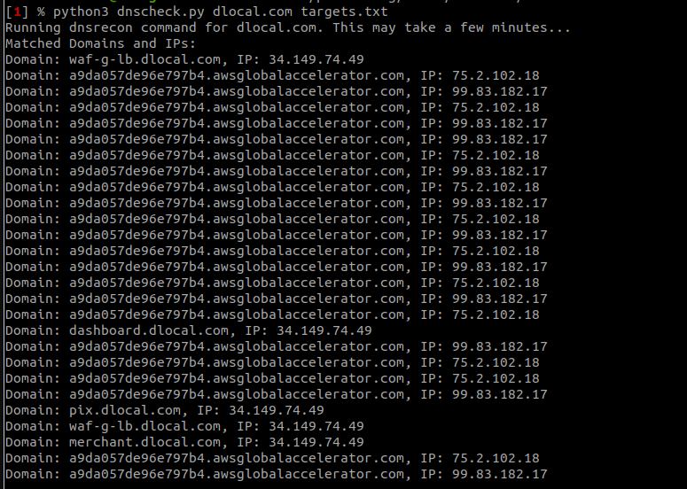

# DNS Recon Check Script

This script (dnscheck.py) combines the functionality of running a DNS recon command using the dnsrecon tool and checking the resulting domains and IPs against a list of IPs provided in a file.

## Requirements

- Python 3.x
- dnsrecon tool

## Usage

To use the script, run the following command in your terminal:

```
python dnscheck.py <domain> <ip_file>
```

```
- `<domain>`: The target domain for which you want to run the DNS recon.
- `<ip_file>`: The path to the file containing a list of IPs to check against the results.
```

The script will run the dnsrecon command and save the output to a file called `out.txt`. Then, it will read the IPs from the input file and check them against the list of domains and IPs extracted from the `out.txt` file. Finally, it will print the matched domains and IPs.

## Example

Assuming you have a file named `ip_list.txt` containing IPs to check against, you can run the script like this:

```
python dnscheck.py example.com ip_list.txt
```


This will run the DNS recon command for the `example.com` domain and check the resulting domains and IPs against the IPs listed in the `ip_list.txt` file.



